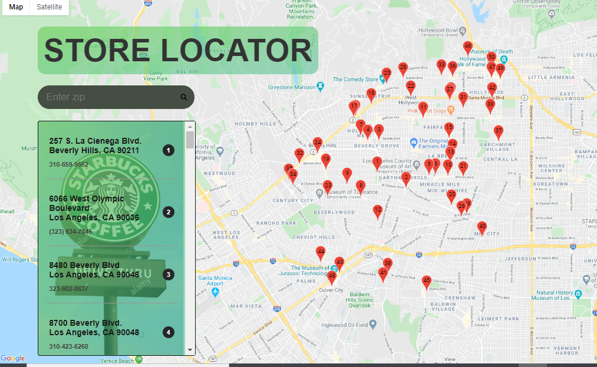

# GoogleStoreLocator

This application is design to Locate Store on Google Map.It displays Location Marks on Map as per Zip Code is enter into search box.It shows information about name and  phone number of store into Information Window when user click on Marker or store displays into list.

# Technology

HTML, CSS3, JavaScript  Google API

## UserStory 

It helps user to locate StarBucks Stores on Google Map. 

# Demo
##  It displays all stores data into list and show Markers on Map

## It displays stores as per zip code 

## It is a live demo of project

# Deployed Link

 https://bipan82gill.github.io/googleStoreLocator/
